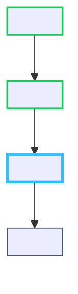

# Roadmap & Curriculum

> Last rebuilt: .doc --all (2026-10-09)

---

## Topic Manifest (`notes/<Topic Name>/manifest.json`)

In the v3.0.0 encapsulated vault architecture, the curriculum DAG is maintained inside each topic vault as `notes/<Topic Name>/manifest.json`. The backend server dynamically compiles the Mermaid `flowchart TD` DAG directly from the manifest's `nodes` and `edges`.

### Schema

```json
{
  "topic": "<Topic Name>",
  "domain": "<Domain>",
  "reference_scope": {
    "collection": "<Collection Name>",
    "tags": ["<tag-1>", "<tag-2>"]
  },
  "nodes": [
    {
      "id": "<Node ID>",
      "title": "<Node Title>",
      "prerequisites": ["<Prerequisite Node ID>"],
      "status": "completed | active | planned | mastered",
      "origin": "curriculum | diagnostic",
      "badge_label": "Curriculum Mastered | In Progress | Baseline Knowledge"
    }
  ],
  "edges": [
    {
      "source": "<Source Node ID>",
      "target": "<Target Node ID>"
    }
  ]
}
```

### Node Status Lifecycle

```
flowchart LR
    planned --> active --> mastered
    diagnostic_baseline --> mastered
```

`bridge.py advance-node` transitions: `active → mastered`, then promotes the next `planned` node to `active`.

### Topological Ordering Contract

The `nodes` array in `manifest.json` **must be committed in exact topological execution order** — the active critical-path depth-first ordering. This guarantees that `bridge.py advance-node` always picks the correct next sequential node by scanning forward from `curr_idx + 1` for the first node that is not `mastered` / `completed` and not `origin: "diagnostic"`.

---

## Dynamic DAG Compilation

The backend (`server.py`) compiles the Mermaid DAG on the fly using canonical node classes:



- **Active Node**: Highlighted with cyan stroke (`#38bdf8`, 3px). Active nodes never share green completed styling.
- **Mastered / Completed**: Highlighted with emerald stroke (`#22c55e`, 2px).
- **Pending**: Slate stroke (`#475569`, 1px).

---

## Prior Knowledge Crawling & Tag Resolution

To prevent redundant concept authoring across independent topic vaults, `scripts/scan_prior_knowledge.py` and the `prior-knowledge-crawler` sub-agent audit candidate concepts against `notes/index.json`.

### Four-Tag Taxonomy

| Classification Tag | Condition | Pedagogical Action |
|---|---|---|
| `[REUSE_CANONICAL]` | Exact match (identical mechanism and same domain) | Link existing vault note directly via relative wikilink `[[../<topic>/<id>\|<Title>]]`. Do not author a duplicate note. |
| `[EXTEND_CONTEXT]` | Partial match (same domain, specialized subtype or extension) | Extend definition in new note while linking prior concept via wikilink. |
| `[DOMAIN_HOMONYM]` | Identical or similar name, completely different domain | Disambiguate with explicit domain scoping in YAML frontmatter and title. |
| `[NOVEL]` | No prior conceptual intersection across historical vaults | Full first-principles scaffolding as a new concept. |

### Execution Commands

- **Topic-Level Crawl** (Phase 1 Probing):
  ```
  python scripts/scan_prior_knowledge.py --topic "<topic>" --output "notes/<topic>/.diagnostic/prior_candidates.json"
  ```
- **Manifest Batch Scan** (Phase 2 Planning):
  ```
  python scripts/scan_prior_knowledge.py --manifest "notes/<topic>/manifest.json"
  ```

---

## `bridge.py advance-node` — Full Execution Sequence

```
python bridge.py advance-node
```

1. **Validate answer**: Read `notes/<topic>/.session/answer.json`. Verify passing criteria (`passed: true`, `score >= 0.70`, or `correct_count == total`). Exit code 1 on failure.
2. **Find current node**: Read `notes/<topic>/manifest.json`. Match `active_node_id` from `state/active_session.json` against manifest nodes.
3. **Mark complete**: Set `nodes[curr_idx].status = "mastered"`, `badge_label = "Curriculum Mastered"`.
4. **Promote note frontmatter**: Directly promote Obsidian YAML frontmatter in `notes/<topic>/<node_id>.md` from `status: "in_progress"` to `status: "mastered"`, appending curriculum mastery callout.
5. **Advance pointer**: Find `next_idx` — first node after `curr_idx` that is not `mastered/completed` and not `origin: "diagnostic"`. Set `nodes[next_idx].status = "active"` and update `active_node_id` in `state/active_session.json`.
6. **Save manifest**: Write updated `manifest.json` atomically.
7. **Check lookahead cache**: Inspect `state/cache/<topic_slug>/verification_<next_nid>.json`. If missing, trigger sync verification.
8. **Buffer cleanup**: Wipe transient `notes/<topic>/.session/` files.
9. **Sync Knowledge Graph**: POST to `/api/graph/sync` with completed node `mastered` and next node `active`.
10. **Print transition output**: `[TRANSITION] Completed '<N>' -> Advanced to '<N+1>' (<id>)`.
11. **Horizon check**: Inspect N+2 and N+3 candidates; print `[HORIZON_STATUS]` and dispatch background verifiers if missing.

---

## Fuzzy Token-Set Deduplication

Used in `/api/graph/sync` to prevent concept fragmentation in the global knowledge graph (`state/knowledge_graph.json`):

```python
def find_fuzzy_concept_match(candidate_title, existing_nodes):
    stopwords = {"and", "or", "the", "of", "in", "&"}
    cand_set = tokenize(candidate_title)

    for each existing_node:
        node_set = tokenize(node.label) or tokenize(node.id)
        union = cand_set | node_set
        intersection = cand_set & node_set
        jaccard = len(intersection) / len(union)

        subset_contained = (
            min(len(cand_set), len(node_set)) >= 3 and
            (cand_set.issubset(node_set) or node_set.issubset(cand_set))
        )

        if jaccard >= 0.60 or subset_contained:
            return existing_node.id  # deduplicate — reuse existing node ID

    return None  # novel concept
```

---

## Canonical ID Derivation (`to_canonical_id`)

Used everywhere IDs need to be normalized:

1. Strip Node/Baseline prefix: `re.sub(r'^(?:Node\s*\d+[:.]\s*|Baseline[:.]\s*|\d+[.)]\s*)', '', text)`
2. Lowercase.
3. Replace non-alphanumeric characters with `-`.
4. Strip leading/trailing `-`.
5. Fallback to `"default"` if empty.

---

## Quiz Progression Logic

### Option Shuffling
`bridge.py shuffle_quiz()` eliminates positional bias before each assessment:
1. For each question, identify `correct_option = options[correct_idx]`.
2. `random.shuffle(options)` in place.
3. Recompute `correct_index = options.index(correct_option)`.
4. Set both `correct_index` and `correct_idx` to the new value.

### Pass Evaluation
`bridge.py advance-node` accepts:
- `passed: true`
- `correct: true`
- `correct_count == total and total > 0`
- `score >= 0.70`

### Retry Behavior
If the quiz is not passed (`bridge.py advance-node` exits code 1), the engine does **not** advance. The quiz remains in `notes/<topic>/.session/quiz.json` and the dashboard displays rationale feedback for incorrect answers.

---

## Topic Completion Lifecycle

When `advance-node` finds no remaining uncompleted nodes in `manifest.json`:

1. Sets `active_session["phase"] = "completed"` and `active_node_id = null`.
2. Prints `[TRANSITION] Completed '<last>' -> Curriculum Completed`.
3. Runs `python scripts/sync_vault_index.py --rebuild` to index all newly generated vault files into `notes/index.json`.
4. Emits completion banner:

```
[TOPIC COMPLETE: <TOPIC>]
-----------------------------------------------------
All nodes mastered and vault index rebuilt.
Explore the complete Obsidian vault in notes/<Topic Name>/
and the global Knowledge Cosmos at http://localhost:8000.
-----------------------------------------------------
```
