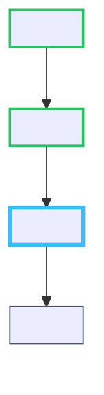

# Roadmap & Curriculum

> Last rebuilt: .doc --all (2026-10-03)

---

## Roadmap DAG (`state/roadmap.mmd`)

The roadmap is a Mermaid `flowchart TD` DAG. It is written by the agent in Phase 2 and updated by `bridge.py advance-node` after every node pass.

### Anatomy of a Roadmap File



### Node Key Convention

| Prefix | Meaning |
|---|---|
| `R*` (e.g. `R1`, `R2`) | Root/Baseline nodes (Phase 1 diagnostic mastery) |
| `N*` (e.g. `N1`, `N2`) | Teaching nodes (Phase 3 curriculum) |

Baseline nodes always carry `:::mastered` when synthesised in Phase 2.

---

## CSS Class Update (bridge.py `update_roadmap_styling`)

After every `advance-node` call, `bridge.py` rewrites the CSS class annotations on all nodes in `state/roadmap.mmd`:

**Priority logic per node:**

1. If `active_node_id` matches this node → `:::active`
2. Else check `node_status_map` (seeded from KG + curriculum nodes):
   - `mastered` → `:::mastered`
   - `completed` → `:::completed`
   - `active` → `:::active` (should not conflict with step 1)
   - Anything else → `:::pending`

The update is done via regex substitution on the raw `.mmd` text — no Mermaid parsing library involved.

---

## Curriculum JSON (`state/curriculum.json`)

### Schema

```json
{
  "nodes": [
    {
      "id": "<Node ID>",
      "title": "<Node Title>",
      "prerequisites": ["<Prerequisite Node ID>"],
      "status": "active",
      "description": "...",
      "badge_label": "In Progress"
    }
  ]
}
```

### Node Status Lifecycle

```
flowchart LR
    pending --> active --> completed
    diagnostic_baseline --> mastered
```

`advance-node` transitions: `active → completed`, then promotes the next `pending` node to `active`.

### Topological Ordering Contract

The `nodes` array in `state/curriculum.json` **must be in exact topological execution order** — the active critical-path depth-first ordering. This guarantees that `bridge.py advance-node` always picks the correct next node by scanning forward from `curr_idx + 1` for the first node that is not `completed` or `mastered` and not `origin: "diagnostic"`.

---

## `bridge.py advance-node` — Full Execution Sequence

```
python bridge.py advance-node
```

1. **Validate answer**: Read `state/answer.json`. Check `passed: true`, `score >= 0.70`, or `correct_count == total`. Exit code 1 on failure.
2. **Find current node**: Read `state/curriculum.json`. Match `active_node_id` from `topic.json` against curriculum nodes via canonical ID.
3. **Mark complete**: Set `nodes[curr_idx].status = "completed"`, `badge_label = "Curriculum Mastered"`.
4. **Archive vault note**: Call `archive_completed_node_vault(completed_node, topic_data)` — extracts the `## Node N: ...` section from `notes/lesson_notes.md` and writes `notes/<topic>/<node_slug>.md` with Obsidian YAML frontmatter in < 10ms.
5. **Advance pointer**: Find `next_idx` — first node after `curr_idx` that is not `completed/mastered` and not `origin: diagnostic`. Set `nodes[next_idx].status = "active"` and update `state/topic.json`.
6. **Promote verification cache**: Check `state/cache/verification_<next_node_id>.json`. If present, atomic move to `state/verification.json`.
7. **Update roadmap CSS**: Call `update_roadmap_styling(ROADMAP_FILE, nodes, new_active_node_id)`.
8. **Cleanup**: Delete `state/quiz.json`, `state/answer.json`, `state/pause.flag`.
9. **Sync KG**: POST to `/api/graph/sync` with completed node `mastered` + next node `active`.
10. **Print output**: `[TRANSITION] Completed '<N>' -> Advanced to '<N+1>' (<id>)`.
11. **Horizon check**: Inspect N+2 and N+3 candidates in curriculum. Print `[HORIZON_STATUS]` and `[LOOKAHEAD]` lines.

---

## Fuzzy Token-Set Deduplication

Used in `/api/graph/sync` to prevent concept fragmentation in the knowledge graph.

### Algorithm (`find_fuzzy_concept_match`)

```
def find_fuzzy_concept_match(candidate_title, existing_nodes):
    stopwords = {"and", "or", "the", "of", "in", "&"}
    cand_set = tokenize(candidate_title)  # lowercase alphanumeric, stopwords removed

    for each existing_node:
        node_set = tokenize(node.label) or tokenize(node.id)
        
        union = cand_set | node_set
        intersection = cand_set & node_set
        jaccard = len(intersection) / len(union)
        
        subset_contained = (
            min(len(cand_set), len(node_set)) >= 3 AND
            (cand_set.issubset(node_set) OR node_set.issubset(cand_set))
        )
        
        if jaccard >= 0.60 OR subset_contained:
            return existing_node.id  # deduplicate — reuse existing
    
    return None  # genuinely new concept
```

**Effect**: "Core Case Particles: Wo, Ni, De" and "Core Case Particles (Accusative/Locative)" would deduplicate because their token Jaccard overlap exceeds 0.60.

---

## Canonical ID Derivation (`to_canonical_id`)

Used everywhere IDs need to be compared across sources:

```
1. Strip Node/Baseline prefix: re.sub(r'^(?:Node\s*\d+[:.]\s*|Baseline[:.]\s*|\d+[.)]\s*)', '', text)
2. Lowercase
3. Replace all non-alphanumeric characters with '-'
4. Strip leading/trailing '-'
5. Fallback to "default" if empty
```

Examples:
- `"Node 2: <Node Title>"` → `"<node-id>"`
- `"Baseline: <Baseline Title>"` → `"<baseline-id>"`

---

## Quiz Progression Logic

### Option Shuffling

`bridge.py shuffle_quiz()` eliminates positional bias before each assessment:

1. For each question, identify `correct_option = options[correct_idx]`.
2. `random.shuffle(options)` in place.
3. Recompute `correct_index = options.index(correct_option)`.
4. Set both `correct_index` and `correct_idx` to the new value.

Called automatically by `bridge.py wait-answer` at startup (`check_and_shuffle_quiz`), and by `save_quiz_atomic` when `shuffle=True`.

### Pass Evaluation

`bridge.py advance-node` accepts any of these as passing:
- `passed: true`
- `correct: true` (single-item backward-compat)
- `correct_count == total AND total > 0`
- `score >= 0.70`

### Retry Behaviour

If the quiz is not passed (`bridge.py advance-node` exits code 1), the agent does **not** advance. The quiz remains in `state/quiz.json` and the dashboard shows the rationale feedback. The agent re-serves the same node's assessment.

---

## Vault Archival (`archive_completed_node_vault`)

After every node pass, `advance-node` automatically extracts and archives the node's lesson to the Obsidian vault:

**File path**: `notes/<Topic Name>/<node_slug>.md` (resolved via `get_topic_notes_dir()`)

**Section extraction**: Splits `notes/lesson_notes.md` on `^## Node \d+` headers and matches by node number or canonical ID.

**Obsidian YAML Frontmatter written:**

```yaml
---
id: <Node ID>
title: <Node Title>
topic: <Topic Name>
domain: <Domain>
aliases:
  - <Node Title Alias>
core_mechanism: Standard operational definition of ...
prerequisites:
  - "[[<Prerequisite Node ID>]]"
verification_status: "[VERIFIED_WEB]"
citation: "Standard Reference Canon"
page_range: "N/A"
---

# <Node Title>

> [!success] Curriculum Mastery
> Mastered through interactive Socratic instruction and verified via checkpoint quiz.
```

After archival, `bridge.py advance-node` also syncs the `mastered` status to `/api/graph/sync`, ensuring the Knowledge Cosmos immediately reflects the new mastery state.

---

## Topic Completion Lifecycle

When `advance-node` finds no remaining non-completed, non-diagnostic nodes:

1. Sets `topic_data["phase"] = "completed"` in `state/topic.json`.
2. Prints `[TRANSITION] Completed '<last>' -> Curriculum Completed`.
3. The agent then runs `scripts/sync_vault_index.py --rebuild` to index all newly generated vault files into `notes/index.json`.
4. Agent emits:

```
[TOPIC COMPLETE: <TOPIC>]
-----------------------------------------------------
All nodes mastered and vault index rebuilt.
Explore the complete Obsidian vault in notes/<Topic Name>/
and the global Knowledge Cosmos at http://localhost:8000.
-----------------------------------------------------
```
