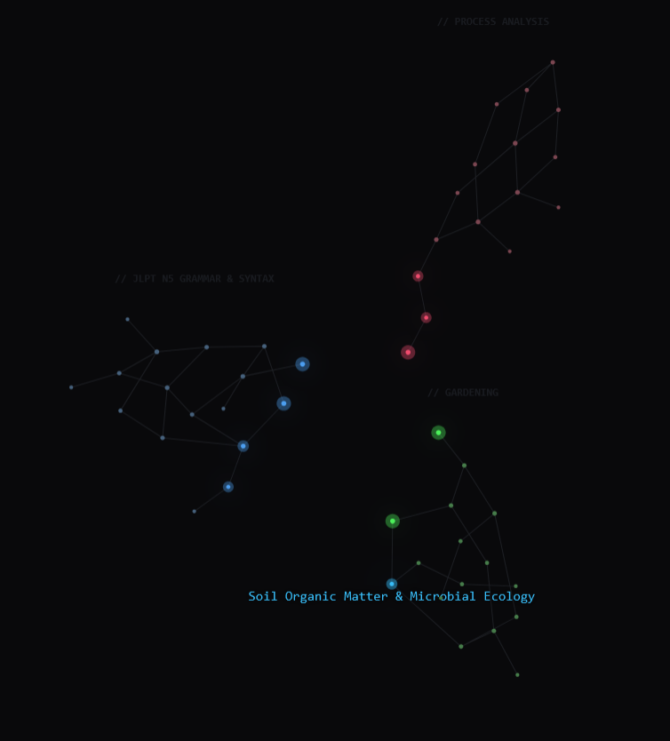
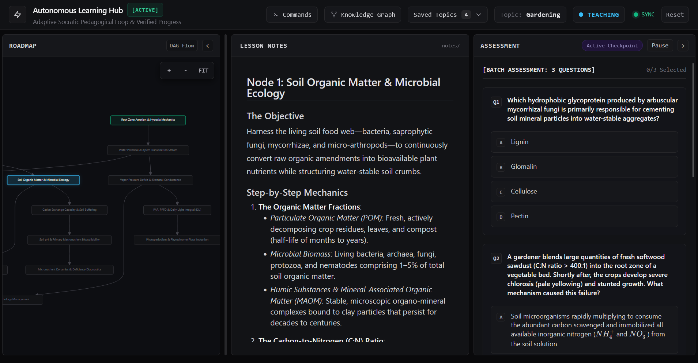
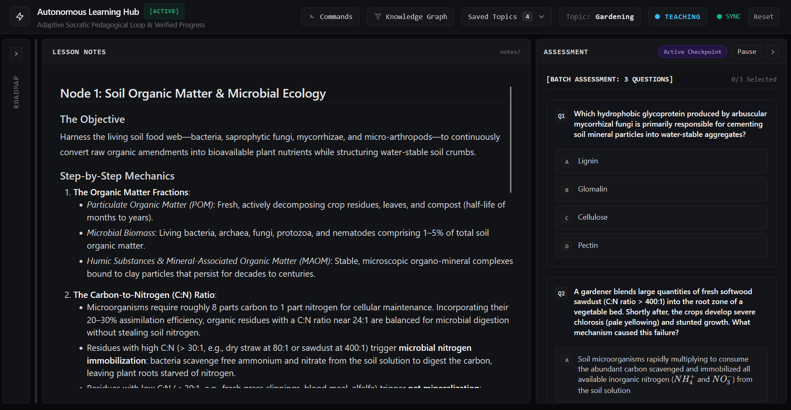

# Socratic Hub: Alvar Method Implementation & Learning Engine

[](LICENSE)
[](https://www.python.org/)
[](scripts/tests/)
[](#architecture--specifications)
[](#core-tenets--alvar-method-operationalization)

> **Quick AI Agent Setup**  
> Paste this single prompt into your IDE agent (Antigravity, Cursor, Claude Code, or Windsurf) in an empty folder:
> ```text
> Clone https://github.com/DownMD/socratic-hub into this empty workspace, then read and execute INIT.md to set up the learning hub for this IDE.
> ```
>
> **Quick AI Agent Update**  
> Already have Socratic Hub installed? Paste this prompt into your existing workspace agent:
> ```text
> Pull latest changes from origin main, install any new dependencies from requirements.txt, verify state/ directory integrity, and restart server:app on port 8000.
> ```

---

**Socratic Hub** is an autonomous, stateful, and topic-agnostic learning engine implementing the **Alvar Method**—the pedagogical framework originated by educational theorist **Eero Alvar** (formalized through the Amos Blomqvist 1-on-1 tutoring architecture). Rather than presenting passive text dumps or unstructured chat replies, Socratic Hub transforms any subject into an interactive pedagogical journey governed by **active recall**, **adaptive curriculum graphs**, and **automated Socratic dialogue**.

Learners cannot simply skim or skip ahead: mastery must be demonstrated through rigorous, multi-tier Socratic checkpoints before downstream concepts unlock. Every mastered concept is synthesized into an Obsidian-compatible local knowledge vault in real time.

---

## Engine in Action

### 1. Interactive Roadmap & Knowledge Graph
Visualize topological dependencies, completed milestones, and pending concept tracks in real time via Mermaid DAGs and the interactive 2D Knowledge Cosmos.
<p align="center">
  
</p>

### 2. Socratic Probing & Active Recall Dialogue
Engage in focused, step-by-step Socratic dialogue where every lesson demands active synthesis rather than passive absorption.
<p align="center">
  
</p>

### 3. Live Verification & Mastery State
Multi-tier diagnostic gates and lookahead academic audits verify concept retention and textbook rigor before advancing.
<p align="center">
  
</p>

---

## What's New

### Knowledge Cosmos 2.0 (Obsidian Graph Overhaul)
* **Dynamic Radial Geometry:** Multi-discipline topics project along balanced angular rays with automatic inner-void scaling ($R_0 \propto \sqrt{N}$), eliminating spoke crowding across 50+ topics.
* **Golden-Ratio Spectral Palette:** Each discipline dynamically inherits high-contrast, non-colliding chromatic families ($\phi = 137.5^\circ$), with mastered nodes casting real-time Canvas glow bloom in their topic's native hue.
* **LOD & Pan/Zoom Stability:** Monospace cluster headers (`// TOPIC`) scale smoothly with screen size and dynamically declutter at global zoom levels.

### Resilient Vault & Note Architecture
* **Archival Deep-Search:** Concept note resolution traverses archived topics (`notes/<Topic>/notes.md`), the active workspace (`lesson_notes.md`), and standalone concept files with fuzzy title containment. Merged canonical IDs never trigger 404s.
* **Click-to-Copy Standby HUD:** Replaced blank idle states with a minimalist, frameless Obsidian cheat sheet featuring interactive clipboard copying for all core CLI flags (`.teach`, `.review`, `--ref`, `--domain`).

---

## Core Tenets & Alvar Method Operationalization

The **Alvar Method**, pioneered by **Eero Alvar**, rejects the illusion of competence generated by passive consumption. Socratic Hub operationalizes this philosophy into three computational pillars:

### 1. First-Principles Scaffolding
* **Topological Prerequisite Decomposition:** Complex domains are decomposed into fine-grained atomic nodes (12–25+ nodes per topic) organized as a Directed Acyclic Graph (DAG).
* **Zero Orphan Concepts:** Every lesson explicitly connects back to foundational primitives or previously verified baseline nodes. No floating facts; every concept is scaffolded from first principles.
* **Domain Depth:** The engine synthesizes parallel prerequisite tracks, ensuring learners understand foundational mechanics prior to advanced operational trade-offs.

### 2. Active Probing over Passive Reading
* **Diagnostic Boundary Probing:** When introducing a topic, Socratic Hub conducts targeted multi-track diagnostic probing (Tier 1 Primitives, Tier 2 Core Mechanics, Tier 3 Advanced Integration) to discover your exact knowledge boundary without wasteful repetition.
* **Anti-Guessing Guardrails:** Success at intermediate mechanics triggers advanced edge checks to rule out lucky guesses, while failures automatically identify prerequisite floors.
* **Strict Mastery Gating:** Learners advance only upon passing randomized, adversarial 3-tier assessments (grounding definitions, operational trade-offs, and misconception traps).

### 3. Self-Healing & Decoupled State
* **Stateful Single Source of Truth:** Engine progress is decoupled from transient LLM context windows and maintained on disk in `state/` (`topic.json`, `curriculum.json`, `quiz.json`, `knowledge_graph.json`).
* **Zero-Leak Knowledge Vault:** Completed nodes write atomically to Obsidian-compliant Markdown (`notes/<topic>/<node_id>.md` and `notes/lesson_notes.md`) complete with YAML frontmatter and cross-track wikilinks.
* **Deterministic Resumability:** Sessions can pause, recover, or survive IDE crashes with zero loss of curriculum state or progress history.

---

## Why Socratic Hub?

| Feature | Standard LLM Chat (ChatGPT, Claude) | Socratic Hub (Alvar Method) |
|---|---|---|
| **Learning Mode** | Passive reading / wall of text | Active recall, step-by-step Socratic dialogue |
| **Pacing** | Unconstrained, easy to skim | Strict progression gating—mastery unlocks next node |
| **Curriculum Structure** | Flat, linear, or ad-hoc explanations | Topological DAG with dependency tracking |
| **Prior Knowledge** | Assumed or re-explained from scratch | Automated multi-track diagnostic baseline probing |
| **Note Taking** | Copy-paste manually from chat | Automatic generation of Obsidian-ready markdown vault |
| **Privacy & Storage** | Ephemeral, hosted on third-party cloud | 100% local files, local state, and local web dashboard |

---

## Universal Topic Agnosticism

Socratic Hub contains no hardcoded subject domains. The Alvar Method's structural decomposition applies across any field:

* **Systems Engineering & Computer Science:**
  ```text
  .teach Distributed Consensus and Raft Protocol
  .teach Linux eBPF Kernel Tracing
  ```
* **Linguistics & Natural Languages:**
  ```text
  .teach Mandarin Phonology and Tonal Contours
  .teach PIE Morphological Reconstruction
  ```
* **Quantitative Finance & Economics:**
  ```text
  .teach Black-Scholes Model and Option Greeks
  .teach Central Bank Liquidity Mechanics
  ```
* **Biomedical & Natural Sciences:**
  ```text
  .teach CRISPR-Cas9 Gene Editing Mechanisms
  .teach Organic Chemistry Stereochemistry
  ```

---

## Quickstart

### Prerequisites
* **Python 3.10+**
* Git

### 1. Clone & Set Up Workspace
```bash
git clone https://github.com/DownMD/socratic-hub.git
cd socratic-hub
```

*(Recommended)* Create and activate a Python virtual environment:
```bash
# macOS/Linux
python3 -m venv .venv
source .venv/bin/activate

# Windows (PowerShell)
python -m venv .venv
.venv\Scripts\Activate.ps1
```

### 2. Install Dependencies
```bash
python -m pip install -r requirements.txt
```

### 3. Launch Local Server
Start the local dashboard and API engine at <http://localhost:8000>:
```bash
python -m uvicorn server:app --host 127.0.0.1 --port 8000 --no-access-log
```
> ℹ️ Port 8000 is fixed for dashboard synchronization. If port 8000 is occupied, consult [`INIT.md`](INIT.md) for diagnostic and port repair steps.

### 4. Start Learning
In your IDE's agent chat window (Antigravity, Cursor, Claude Code, or Windsurf), enter:
```text
.teach <topic>
```

---

## Control Commands

| Command | Action |
|---|---|
| `.teach <topic>` | Decomposes topic, runs diagnostic probing, builds DAG, and begins learning |
| `.resume <topic>` | Resumes an active or paused session at the current unmastered node |
| `.stop` | Archives the current session, saves progress, and pauses learning |
| `.start` / `.open` | Launches the local dashboard without altering active session state |
| `.kill` | Archives the session and shuts down the local background server |

---

## Supported IDEs & Agent Configurations

Socratic Hub integrates seamlessly with major AI development environments via IDE-specific rule configurations pointing to the core state machine:

| Environment | Agent Instruction File | Integration Details |
|---|---|---|
| **Google Antigravity** | [`AGENTS.md`](AGENTS.md) | Primary state machine specification and subagent verifier rules |
| **Cursor** | [`.cursorrules`](.cursorrules) | Root agent rules forwarding to `AGENTS.md` |
| **Claude Code** | [`CLAUDE.md`](CLAUDE.md) | CLI agent instructions and command triggers |
| **Windsurf** | [`.windsurfrules`](.windsurfrules) | Cascade rules forwarding to `AGENTS.md` |
| **GitHub Copilot** | [`.github/copilot-instructions.md`](.github/copilot-instructions.md) | Copilot chat persona and file boundary constraints |

Detailed setup and troubleshooting instructions are provided in [`INIT.md`](INIT.md).

---

## Architecture & Specifications

For developers, contributors, and agents looking to inspect or extend the underlying engine, comprehensive technical documentation is located in the [`.doc/`](.doc/) directory:

* [`.doc/pedagogy_and_agents.md`](.doc/pedagogy_and_agents.md) — Comprehensive treatise on the Alvar Method, Amos Blomqvist framework, diagnostic budgets, and pedagogical blueprints (Quantitative, Language, Practical, Strategy, First-Principles).
* [`.doc/roadmap_and_curriculum.md`](.doc/roadmap_and_curriculum.md) — DAG generation algorithm, topological sorting, prior knowledge scanning, and deduplication logic.
* [`.doc/api_and_state.md`](.doc/api_and_state.md) — REST API endpoints, WebSocket sync, and JSON state schemas (`state/*.json`).
* [`.doc/architecture.md`](.doc/architecture.md) — IPC bridge mechanisms, file system state boundaries, and subagent verification pipelines.
* [`.doc/frontend_guide.md`](.doc/frontend_guide.md) — Real-time reactive dashboard, Knowledge Cosmos 2D graph renderer, and theme specifications.
* [`.doc/maintenance.md`](.doc/maintenance.md) — Vault synchronization, reference ingestion, and documentation generator scripts.

---

## Pedagogical Attribution

The pedagogical tenets embodied in this project—including prerequisite track partitioning, multi-tiered diagnostic probing, active recall gates, and first-principles mastery scaffolding—are based on the **Alvar Method** developed by **Eero Alvar**, implemented via the **Amos Blomqvist** 1-on-1 tutoring architecture.

Socratic Hub provides the autonomous software implementation: multi-agent coordination, file-based state orchestration, interactive web visualization, and automated knowledge graph synthesis.

---

## License

This project is licensed under the [MIT License](LICENSE). Copyright &copy; 2026 Down MD.
